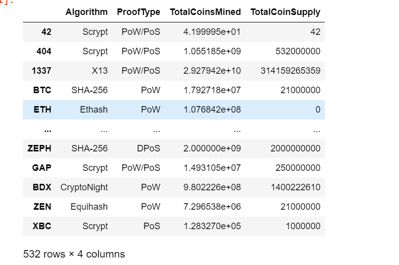
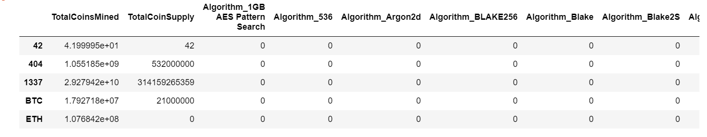
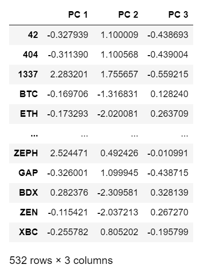
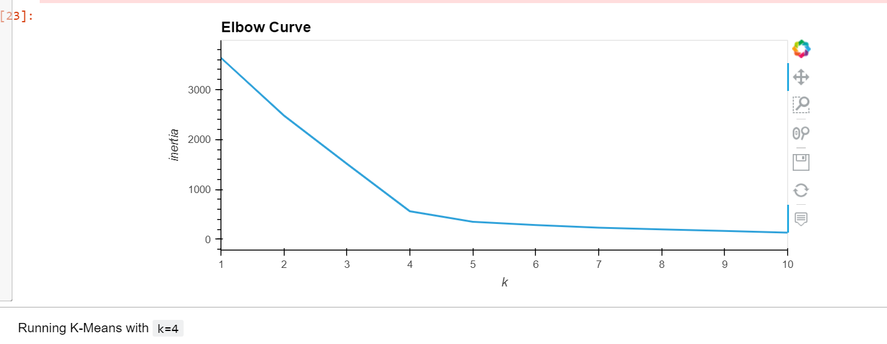
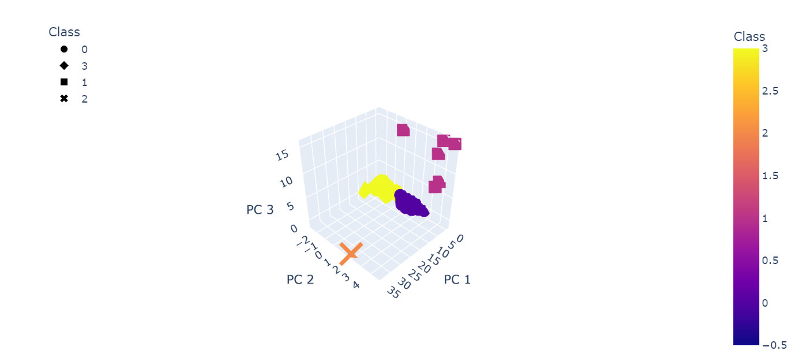
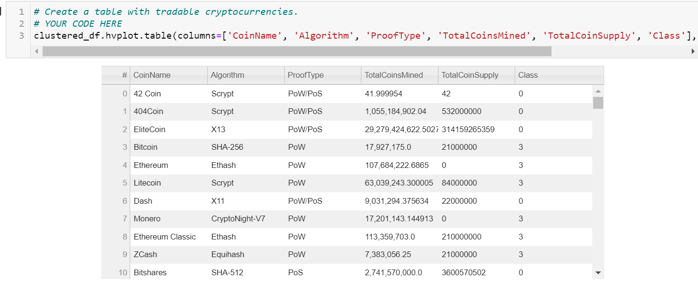
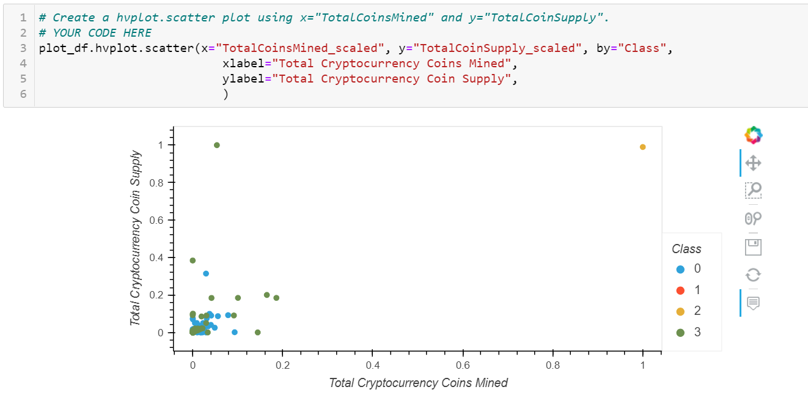

# Cryptocurrencies
## Overview
The purpose of this project is to create a report that includes what cryptocurrencies are on the trading market and how they could be grouped to create a classification system for this new investment.
Unsupervised machine learning algorithms are used for no known output. To be specific, it is grouping unlabled data into distinct clusters; Detecting unusual data points in dataset; Reducing large datasets into smaller datasets while preserving most of the useful information.
A clustering algorithm will be selected to group the cryptocurrencies and final results will be presented through data visualizations. 

## Analysis process
### 1.Preprocessing the Data for PCA
Data preprocessing refers to the technique of cleaning and organizing the raw data to fit the trained Machine Learning models.
In this project, "dropna()" to remove null values, "drop(columns=[])" to drop "IsTrading" column, and drop cryptocurrencies without conins mined; "get_dummies()" was used to convert variables from text features to binary format; "StandardScaler()" was used to standardize and transform the data.
Image 1: crtpto_df (drop all the unnecessary data) 532 rows x 4 columns

Image 2: dropping rows with null data and converting columns containing text to binary format. 532 rowx 98 columns

### 2.Reducing Data Dimensions Using PCA
Principal Component Analysis is a statistical technique to speed up machine learning alorithms by reducing the number of dimensions. It allows us to transform large sets of variables into smaller ones that contain most of the informaion. In this project, the DataFrame was reduced to 3 princial component using PCA method.
Image 3: 3 princial components

### 3.Clustering Cryptocurrencies Using K-means
Clustering mainly deals with finding a structure or pattern in a collection of uncategorized data in unsupervised learning. K-means is unsupervised learning algorithm used to identify clusters. In K-means clustering, each group is defined by creating a centroid for each group. the centroid are the center of the cluster, which capture the points closest to them and adds them to the cluster.
The best number to find K-means value for the model is an elbow curve.
Image 4: Elbow Curve

### 4.Visualizing Cryptocurrencies Results
Image 5: 3-D scatter plot of the three Principal Components showing the clusters

Image 6: A hvplot.table to visualize all the current tradable cryptocurrencies.

Image 7: A 2D scatter plot to visualize "Total Coins Mined" vs. "Total Coin Supply" by coin name and clusters.

## Summary
A total of 532 cryptocurrencies have been classified into four different classes based on similarities of their features.

